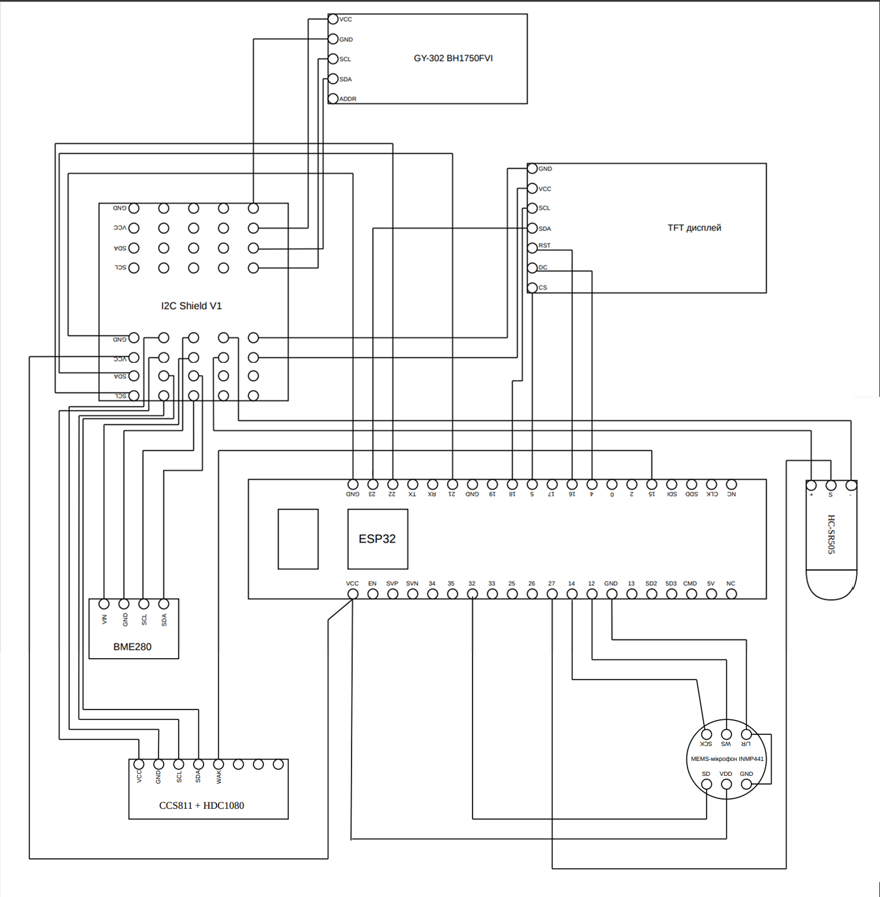
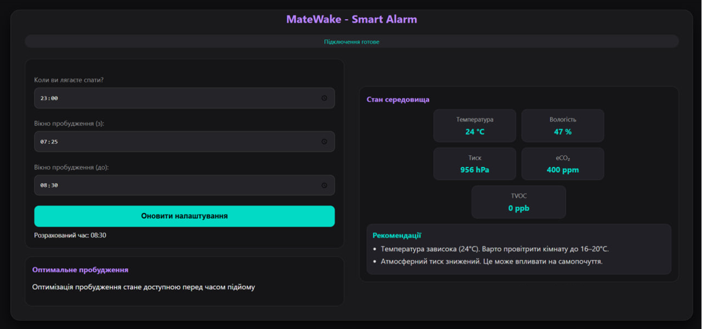
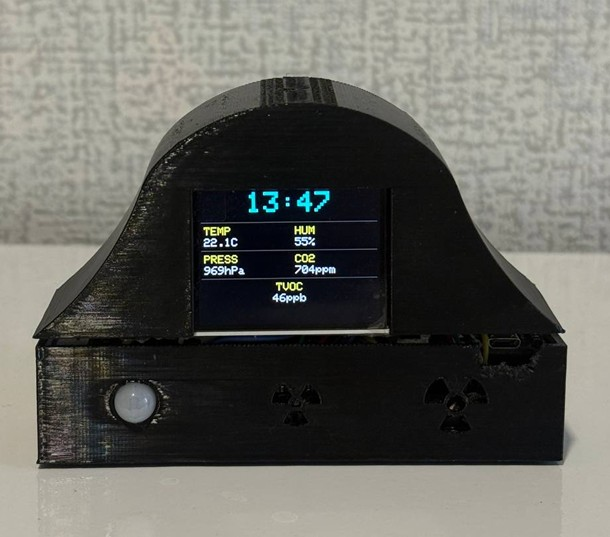

# 🌙 MateWake - Smart Alarm

> IoT-система розумного будильника, що відстежує фази сну та коригує час пробудження, а також моніторить мікроклімат приміщення на базі ESP32.

---

## 👤 Автор

- **ПІБ**: Савицька Вікторія
- **Група**: ФЕІ-44
- **Керівник**: Коростенський Роман, асистент
- **Дата виконання**: 25.05.2026

---

## 📌 Загальна інформація

- **Тип проєкту**: Вбудована система + Веб-інтерфейс
- **Мови програмування**: C++ (ESP32), JavaScript (Web)
- **Фреймворки / Бібліотеки**: Arduino/PlatformIO, WiFiManager, PubSubClient, ArduinoJson, TFT_eSPI,
  Adafruit BME280, Adafruit CCS811, BH1750, ClosedCube HDC1080, MQTT.js

---

## 🧠 Опис функціоналу

- 😴 Моделювання фаз сну (N1, N2, N3, REM) за циклами
- 📡 Передача даних через MQTT (HiveMQ broker)
- 🌡️ Моніторинг температури, вологості, тиску, eCO₂, TVOC
- 🔊 Аналіз шуму, руху та освітлення для визначення поточної фази
- ⏰ Оптимізація часу пробудження у заданому вікні
- 🌐 Веб-дашборд з рекомендаціями та статусом у реальному часі

---

## 🧱 Структура проєкту

| Файл / Папка         | Призначення |
|----------------------|-------------|
| `firmware/src/main.cpp`     | Основний код мікроконтролера ESP32 |
| `firmware/platformio.ini`   | Конфігурація проєкту PlatformIO |
| `web/index.html`            | Структура веб-інтерфейсу |
| `web/app.js`                | Логіка розрахунку фаз та MQTT-клієнт |
| `web/style.css`             | Стилі інтерфейсу |
| `web/alarm.mp3`             | Звук сигналу пробудження |

---

## 🔌 MQTT-топіки

| Топік | Напрям | Опис |
|-------|--------|------|
| `diploma/smart_alarm/001/settings`    | Web → ESP32 | Налаштування сну та вікна пробудження |
| `diploma/smart_alarm/001/optimized`   | ESP32 → Web | Поточна фаза, режим, рекомендований час |
| `diploma/smart_alarm/001/environment` | ESP32 → Web | Параметри мікроклімату |

---

## 🧩 Архітектура системи

```
                        settings                                 settings
  ┌──────────────┐ ──────────────────► ┌──────────────────┐ ──────────────────► ┌─────────────────────┐
  │  Веб-панель  │                     │  HiveMQ брокер   │                     │        ESP32        │
  │  JavaScript  │ ◄────────────────── │ broker.hivemq.com│ ◄────────────────── │     Arduino / C++   │
  └──────────────┘     optimized/      └──────────────────┘     optimized/      └─────────▲───────────┘
                      environment                              environment     /          │
                                                                              /           │
                                                                             / ┌──────────┴───────────┐
                                                                            /  │       Сенсори        │
                                                                           /   │    BME280   CCS811   │
                                                                          /    │   BH1750   HC-SR505  │
                                                                        /      │        INMP441       │
                                                                      /        └──────────────────────┘
                                                                    /                
                                           ┌──────────────────────▼┐
                                           │      TFT дисплей      │                  
                                           │ Локальне відображення │                  
                                           └───────────────────────┘                                                                                                                        
```

## 🛠️ Підключення датчиків (ESP32)



---

## ▶️ Як запустити проєкт 

### 🔧 Прошивка ESP32

#### 1. Встановлення інструментів
- Встановити [VS Code](https://code.visualstudio.com/)
- Встановити розширення [PlatformIO IDE](https://platformio.org/install/ide?install=vscode) у VS Code

#### 2. Клонування репозиторію
```bash
git clone https://github.com/SavytskaViks/matewake-smart-alarm.git
cd matewake-smart-alarm
```

#### 3. Відкрити проєкт прошивки
- У VS Code: **File → Open Folder** → вибрати папку `firmware/`
- PlatformIO автоматично підтягне всі бібліотеки з `platformio.ini`:
  `Adafruit BME280`, `Adafruit CCS811`, `BH1750`, `ClosedCube HDC1080`,
  `PubSubClient`, `ArduinoJson`, `WiFiManager`, `TFT_eSPI`

#### 4. Підключити ESP32 до комп'ютера
- Підключити плату через USB
- У нижній панелі PlatformIO натиснути кнопку **→ Upload**

#### 5. Перший запуск - налаштування Wi-Fi
- ESP32 підніме власну Wi-Fi точку **MateWake-Setup**
- Підключитись до неї з телефону або ноутбука
- Відкриється сторінка налаштувань → ввести назву та пароль своєї Wi-Fi мережі
- Після збереження ESP32 перезавантажиться і підключиться до мережі

---

### 🌐 Веб-інтерфейс

#### 1. Відкрити сайт
- Перейти в папку `web/`
- Відкрити файл `index.html` у браузері (двічі клікнути)
- Інсталяція не потрібна — вебінтерфейс працює як статична HTML-сторінка

#### 2. Підключення
- Сайт автоматично підключається до публічного MQTT брокера **HiveMQ**
- У верхній частині сторінки з'явиться статус **"Підключення готове"**

> ⚠️ ESP32 і браузер мають бути підключені до інтернету - зв'язок відбувається через MQTT брокер.

---

## 🖱️ Інструкція для користувача

1. Вказати час відходу до сну
2. Задати вікно пробудження (наприклад, 06:30 – 07:00)
3. Натиснути **«Оновити налаштування»** - дані передаються на ESP32
4. Система визначає оптимальний момент пробудження у межах заданого вікна
5. Вебінтерфейс показує поточну фазу, стан середовища та рекомендації щодо покращення

---

## 🧪 Можливі проблеми

| Проблема | Рішення |
|----------|---------|
| ESP32 не підключається до Wi-Fi | Утримати кнопку BOOT (GPIO0) під час перезавантаження для скидання Wi-Fi налаштувань |
| MQTT не з'єднується | Перевірити інтернет; брокер `broker.hivemq.com:1883` |
| CCS811 не відповідає | Перевірити підтягуючий резистор на WAK (GPIO15 → GND) |
| Дані не оновлюються на сайті | Перевірити статус з'єднання у верхній панелі |

---

## 📷 Скриншоти
### Веб-інтерфейс


### Пристрій


---

## 🧾 Використані джерела

- [ESP32 Technical Datasheet](https://documentation.espressif.com/esp32_datasheet_en.pdf)
- [BME280 Environmental Sensor Datasheet](https://cdn-shop.adafruit.com/datasheets/BST-BME280_DS001-10.pdf)
- [CCS811 Air Quality Sensor Datasheet](https://arduino.ua/files/CCS811_Datasheet-DS000459.pdf)
- [BH1750FVI Light Sensor Datasheet](https://arduino.ua/docs/ADC154/BH1750FVI.pdf)
- [INMP441 Digital Microphone Datasheet](https://arduino.ua/files/INMP441.PDF)
- [PIR Motion Sensor Datasheet](https://static.rapidonline.com/pdf/78-4110_v1.pdf)
- [PlatformIO Documentation](https://docs.platformio.org/en/latest/what-is-platformio.html)
- [MQTT Essentials – HiveMQ](https://www.hivemq.com/blog/mqtt-essentials-part-1-introducing-mqtt/)
- [PubSubClient (MQTT)](https://github.com/knolleary/pubsubclient)
- [ArduinoJson](https://arduinojson.org/)
- [MQTT.js для браузера](https://github.com/mqttjs/MQTT.js)
